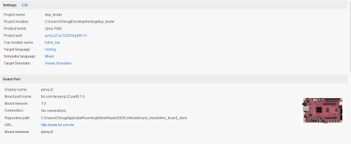
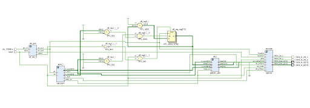
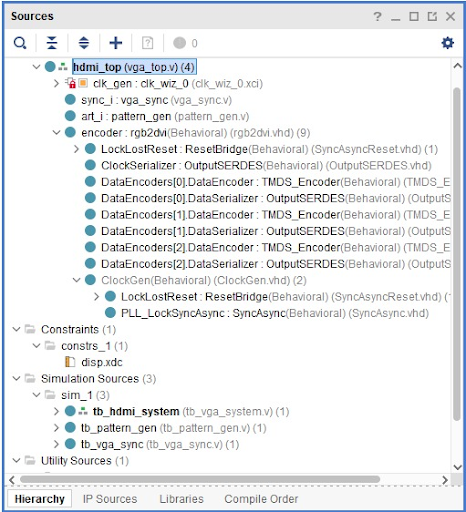
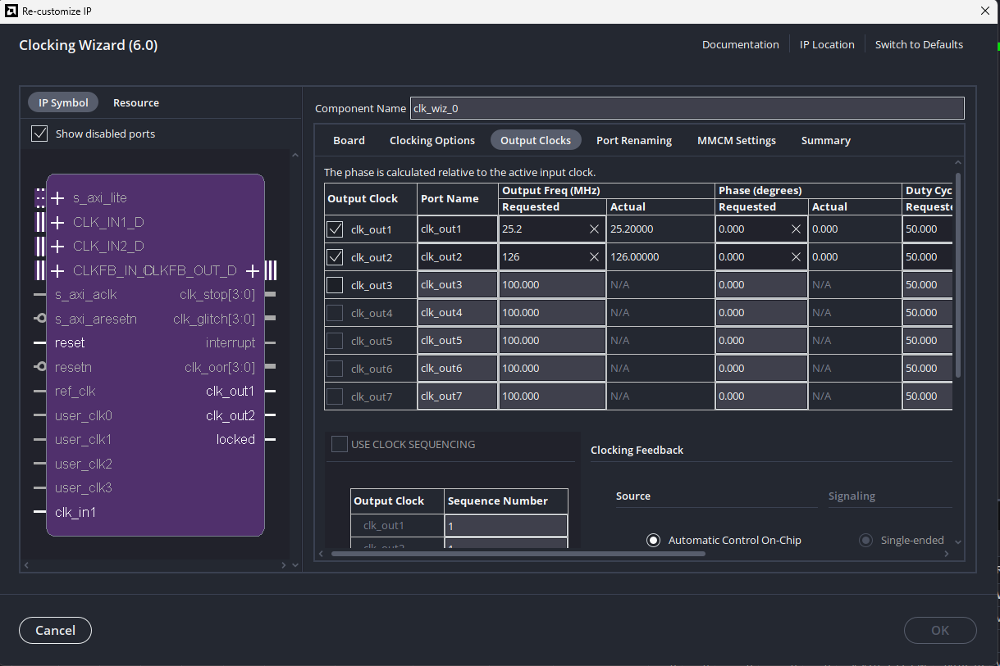
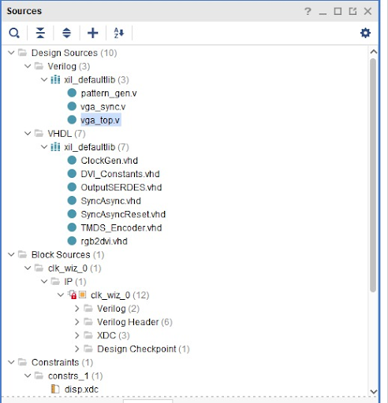
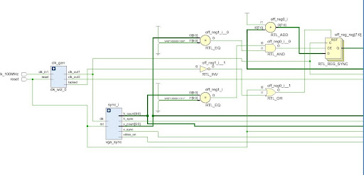
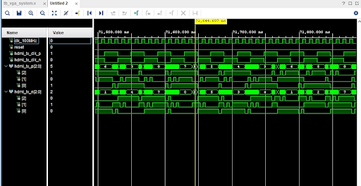
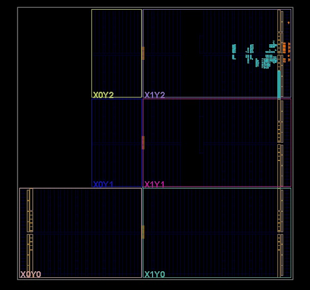

=========================================================
VGA/HDMI Display Test System (640x480) Verilog/VHDL Design
=========================================================

I. Design Requirements
----------------------

In modern digital systems and FPGA application development, high-speed video transmission and real-time dynamic rendering serve as primary benchmarks to evaluate hardware timing closure and overall system throughput. 

|image0|

The digital display controller interacts directly with memory structures and serialized physical layers to perform several critical operations: (1) Generating precision timing grids compliant with standard VESA specifications[cite: 14, 32]; (2) Transforming multi-quadrant mathematical coordinate planes into pixel matrices and color profiles in real time[cite: 123, 126, 133, 140, 148]; (3) Managing data bus serialization over physical interface links [cite: 18]; and (4) Orchestrating complex asynchronous multi-clock domains to guarantee robust operations[cite: 19, 296].

Compared to traditional parallel analog VGA interfaces, digital differential transmission architectures (such as HDMI/DVI) achieve significant noise immunity and greater bandwidth efficiencies using a lower physical pin footprint.

This document presents the structural implementation of a high-performance 640x480 @ 60Hz VGA/HDMI display testing system implemented on the **TUL PYNQ-Z2 (xc7z020clg400-1) FPGA** platform using a mixed Verilog and VHDL design flow[cite: 10, 14, 17, 18].

II. Hardware Architecture
-------------------------

|image1|

As illustrated in the system topology layout[cite: 14, 15], the design integrates structural hardware components to establish a full digital video generation pipeline. The layout includes a central clock conditioning core, a standard timing synchronizer grid, a dynamic pixel generator array, and a physical layer differential serial encoding transmitter.

2.1 Timing and Clocking Infrastructure
~~~~~~~~~~~~~~~~~~~~~~~~~~~~~~~~~~~~~~

2.1.1 Internal Source File Hierarchy
^^^^^^^^^^^^^^^^^^^^^^^^^^^^^^^^^^^^

The layout inside the Xilinx Vivado environment utilizes mixed-language implementation libraries. The structural line-frame counters and pixel graphics rendering stages are developed using custom Verilog code blocks to preserve optimal parallel hardware execution profiles[cite: 17]. The underlying Transition-Minimized Differential Signaling (TMDS) conversion and serialization pipelines are built by importing official, native hardware support primitives written in VHDL[cite: 18].

|image2|

The complete top-level hardware module dependency layout and synthesis module compilation tree are shown in the configuration image above[cite: 16].

2.1.2 Clocking Wizard IP Architecture
^^^^^^^^^^^^^^^^^^^^^^^^^^^^^^^^^^^^^

High-speed serial video buses require low jitter parameters and precise phase synchronization tracking profiles. The system configures a native **Xilinx Clocking Wizard IP (`clk_wiz_0`)** featuring an internal Mixed-Mode Clock Manager (MMCM) to synthesize the 100 MHz onboard differential oscillator source into two asynchronous operational clock domains[cite: 19, 195]:

|image6|

1. **Pixel Clock (`pix_clk` - 25.2 MHz)**: Explicitly tuned to standard VESA parameters to drive a 640x480 active scan grid at a 60Hz refresh rate cycle[cite: 14, 19].
2. **Serial Transmission Clock (`ser_clk` - 126.0 MHz)**: Runs at exactly **5x** the frequency of the pixel clock tracking baseline[cite: 19]. This clock drives the parallel-to-serial Double Data Rate (DDR) output serializers (`OSERDES`) across the differential physical transmission lanes[cite: 18].

|image3|

The separate modular language library mapping summary view within the Vivado design hierarchy is shown above[cite: 17].

2.2 Design Core Modules
~~~~~~~~~~~~~~~~~~~~~~~

2.2.1 VGA Timing Synchronizer (`vga_sync.v`)
^^^^^^^^^^^^^^^^^^^^^^^^^^^^^^^^^^^^^^^^^^^

The timing conductor core of the video pipeline. It constructs the horizontal line registers, vertical frame matrices, active-low line sync pulses (`h_sync`), frame sync pulses (`v_sync`), and the active video display validation window flag (`video_on`)[cite: 26, 27, 28, 29, 30].

Verilog Source Code:

.. code:: verilog

   module vga_sync (
       input  wire        clk,        // 25.175 MHz Pixel Clock
       input  wire        rst,        // Reset
       output reg  [9:0]  h_count,    // Horizontal position (0-799)
       output reg  [9:0]  v_count,    // Vertical position (0-524)
       output wire        h_sync,     // Horizontal Sync Pulse
       output wire        v_sync,     // Vertical Sync Pulse
       output wire        video_on    // High when pixels are in the 640x480 area
   );
       // VESA Standard 640x480 @ 60Hz Constants
       // Horizontal Timing
       localparam H_ACTIVE = 640;
       localparam H_FRONT  = 16;
       localparam H_SYNC   = 96;
       localparam H_BACK   = 48;
       localparam H_TOTAL  = 800;
       // Vertical Timing
       localparam V_ACTIVE = 480;
       localparam V_FRONT  = 10;
       localparam V_SYNC   = 2;
       localparam V_BACK   = 33;
       localparam V_TOTAL  = 525;

       // 1. Horizontal Counter
       always @(posedge clk or posedge rst) begin
           if (rst)
               h_count <= 0;
           else if (h_count == H_TOTAL - 1)
               h_count <= 0;
           else
               h_count <= h_count + 1;
       end

       // 2. Vertical Counter (Increments only when h_count hits the end of a line)
       always @(posedge clk or posedge rst) begin
           if (rst)
               v_count <= 0;
           else if (h_count == H_TOTAL - 1) begin
               if (v_count == V_TOTAL - 1)
                   v_count <= 0;
               else
                   v_count <= v_count + 1;
           end
       end

       // 3. Generate Sync Pulses (Active-Low)
       assign h_sync = (h_count >= (H_ACTIVE + H_FRONT) && h_count < (H_ACTIVE + H_FRONT + H_SYNC)) ? 1'b0 : 1'b1;
       assign v_sync = (v_count >= (V_ACTIVE + V_FRONT) && v_count < (V_ACTIVE + V_FRONT + V_SYNC)) ? 1'b0 : 1'b1;

       // 4. Video On Logic (High only in the active 640x480 window)
       assign video_on = (h_count < H_ACTIVE) && (v_count < V_ACTIVE);
   endmodule

The logic uses an asynchronous active-high reset layout[cite: 46, 55]. Counters increment sequentially on the pixel clock edge[cite: 46, 55]. When coordinates exceed the 640x480 boundary window, the `video_on` signal forces a black-level clamp across the blanking region intervals[cite: 69].

|image4|

The synthesized structural RTL module circuit diagram generated by Vivado is illustrated above[cite: 20].

2.2.2 Diagnostic Pattern Generator (`pattern_gen.v`)
^^^^^^^^^^^^^^^^^^^^^^^^^^^^^^^^^^^^^^^^^^^^^^^^^^^^

This module transforms structural mathematical operations into multi-color visualization values linked to current coordinate locations. It partitions the active view grid into four structural test quadrants, using an animated sequence stepping variable (`offset`) to translate graphics in real time[cite: 112]:

- **Latency Analysis Indicator (Flicker Pixel)**: A single white test coordinate tracked diagonally across frames to evaluate hardware pathway presentation delay metrics[cite: 123, 124, 125].
- **Quadrant 1 (Top-Left)**: Implements dynamic scrolling vertical red, green, and blue calibration stripes using custom indexing bitwise register masks[cite: 126, 128, 129, 130].
- **Quadrant 2 (Top-Right)**: Evaluates high-contrast spatial definition using a geometric field array of yellow circles driven by an inline circle distance equation: `(x² + y²) < r²`[cite: 133, 135, 136].
- **Quadrant 3 (Bottom-Left)**: Produces a linear monochrome greyscale ramp tracking the vertical line indices to analyze terminal display gamma curves and contrast parameters[cite: 148, 150].
- **Quadrant 4 (Bottom-Right)**: Features a dynamic bounding pink diamond element executing bounding frame edge calculation bounces[cite: 140, 142, 144].

Verilog Source Code:

.. code:: verilog

   module pattern_gen (
       input  wire [9:0] h_count,
       input  wire [9:0] v_count,
       input  wire       video_on,
       input  wire [7:0] offset,     // For scrolling/animation
       output reg  [3:0] red,
       output reg  [3:0] green,
       output reg  [3:0] blue
   );
       wire [4:0] local_x = (h_count + offset) & 5'h1F;
       wire [4:0] local_y = v_count & 5'h1F;

       always @(*) begin
           if (!video_on) begin
               {red, green, blue} = 12'h000;
           end else begin
               // LATENCY TEST: A single white pixel that "flickers" on specific counts
               if (h_count == offset && v_count == offset)
                   {red, green, blue} = 12'hFFF;
                   
               // QUADRANT 1: Scrolling Stripes (Top-Left)
               else if (h_count < 320 && v_count < 240) begin
                   if (((h_count + offset) & 6'h3F) < 21)      {red, green, blue} = 12'hF00; // Red
                   else if (((h_count + offset) & 6'h3F) < 42) {red, green, blue} = 12'h0F0; // Green
                   else                                        {red, green, blue} = 12'h00F; // Blue
               end
               
               // QUADRANT 2: Miniature Tiled Shapes (Top-Right)
               else if (h_count >= 320 && v_count < 240) begin
                   if (((local_x-16)*(local_x-16) + (local_y-16)*(local_y-16)) < 64)
                       {red, green, blue} = 12'hFF0; // Yellow Circles
                   else
                       {red, green, blue} = 12'h440; // Background
               end
               
               // QUADRANT 4: Big Bouncing Diamond (Bottom-Right)
               else if (h_count >= 320 && v_count >= 240) begin
                   if (((h_count > (480 + offset[5:0]) ? h_count-(480+offset[5:0]) : (480+offset[5:0])-h_count) +
                        (v_count > 360 ? v_count-360 : 360-v_count)) < 40)
                       {red, green, blue} = 12'hF0F;
                   else
                       {red, green, blue} = 12'h222;
               end
               
               // QUADRANT 3: Grayscale Ramp (Bottom-Left)
               else begin
                   red = h_count[7:4]; green = h_count[7:4]; blue = h_count[7:4];
               end
           end
       end
   endmodule

|image5|

The combination logic, multiplier components, and multiplexer networks within the pattern generation block are shown above.

2.2.3 Physical Layer Pipeline Top Module (`hdmi_top.v`)
^^^^^^^^^^^^^^^^^^^^^^^^^^^^^^^^^^^^^^^^^^^^^^^^^^^^^^^^^

The primary structural top module container managing internal clock domains, synchronization busses, and rendering planes[cite: 14]. Since the physical layer processing interface targets an 8-bit standard color-depth index, this module dynamically scales the 4-bit multi-quadrant graphic metrics to standard 8-bit format by inserting low-order bits padding before routing streams to the physical serializer[cite: 243].

Verilog Source Code:

.. code:: verilog

   module hdmi_top (
       input  wire        clk_100MHz,    // Pin H16
       input  wire        reset,         // Pin D19
       output wire        hdmi_tx_clk_p, // HDMI Clock +
       output wire        hdmi_tx_clk_n, // HDMI Clock -
       output wire [2:0]  hdmi_tx_p,     // HDMI Data +
       output wire [2:0]  hdmi_tx_n      // HDMI Data -
   );
       // Internal Signals
       wire [9:0] h_c, v_c;
       wire v_on, h_s, v_s;
       wire [3:0] r, g, b;
       wire pix_clk, ser_clk, locked;
       reg [7:0] off_reg = 0;

       // 1. Clocking Wizard IP
       clk_wiz_0 clk_gen (
           .clk_in1(clk_100MHz),
           .clk_out1(pix_clk),   // 25.2 MHz
           .clk_out2(ser_clk),   // 126.0 MHz
           .reset(reset),
           .locked(locked)
       );

       // 2. Motion Offset Logic (Increments once per full frame)
       always @(posedge pix_clk) begin
           if (reset || !locked)
               off_reg <= 0;
           else if (h_c == 799 && v_c == 524)
               off_reg <= off_reg + 1;
       end

       // 3. Timing Generator (The Conductor)
       vga_sync sync_i (
           .clk(pix_clk), .rst(reset),
           .h_count(h_c), .v_count(v_c),
           .h_sync(h_s), .v_sync(v_s), .video_on(v_on)
       );

       // 4. Pattern Generator (The Artist)
       pattern_gen art_i (
           .h_count(h_c), .v_count(v_c), .video_on(v_on),
           .offset(off_reg), .red(r), .green(g), .blue(b)
       );

       // 5. HDMI/DVI Encoder (VHDL Imported Core Architecture Module)
       rgb2dvi #(
           .kGenerateSerialClk(1'b0),
           .kClkPrimitive("MMCM")
       ) encoder (
           .TMDS_Clk_p(hdmi_tx_clk_p), .TMDS_Clk_n(hdmi_tx_clk_n),
           .TMDS_Data_p(hdmi_tx_p),    .TMDS_Data_n(hdmi_tx_n),
           .aRst(reset),
           .vid_pData({r, 4'b0, g, 4'b0, b, 4'b0}), // 4-bit to 8-bit padding
           .vid_pVDE(v_on),
           .vid_pHSync(h_s),
           .vid_pVSync(v_s),
           .PixelClk(pix_clk),
           .SerialClk(ser_clk)
       );
   endmodule

2.3 System Schematic (Comprehensive Overview)
~~~~~~~~~~~~~~~~~~~~~~~~~~~~~~~~~~~~~~~~~~~~~

|image7|

The macro-level Register Transfer Level (RTL) schematic diagram generated across individual module definitions is shown above[cite: 285]. It charts internal paths spanning clock tree distribution loops, sync state vector propagation, and serializer input structures. The parallel bus coordinates feed rendering data from the pixel clocks into high-speed TMDS serialized transmission engines mapping out to physical board lines[cite: 19].

III. Pipeline Synchronization Control
-------------------------------------

While video frame processing relies heavily on structural coordinate counters, the macro state lifecycle transitions remain governed by the MMCM clock synchronization loop lock state and physical reset parameters[cite: 219]. The state flow logic tracks several primary milestones:

============ ============== ===================================
System State Operating Mode Functional Description
============ ============== ===================================
S_IDLE       Reset State    Hardware reset active or MMCM lock failure state; outputs grounded.
S_LOCK_WAIT  Wait for Lock  Awaiting MMCM feedback loop optimization flag; blanking fields on.
S_ACTIVE_VID Active Video   Coordinate counters processing within 640x480 active view windows.
S_H_BLANK    H-Blanking     Line counter inside 640 to 799 range; driving standard H_SYNC fields.
S_V_BLANK    V-Blanking     Frame counter inside 480 to 524 range; driving standard V_SYNC fields.
============ ============== ===================================

The state condition evaluation constraints map to the following verification paths:

+--------------+--------------+-----------------------------------------------+
| Source State | Target State | Condition Parameter Flag                      |
+==============+==============+===============================================+
| S_IDLE       | S_LOCK_WAIT  | De-assertion of master hardware reset line    |
+--------------+--------------+-----------------------------------------------+
| S_LOCK_WAIT  | S_ACTIVE_VID | Clocking core asserts lock complete status    |
+--------------+--------------+-----------------------------------------------+
| S_ACTIVE_VID | S_H_BLANK    | Horizontal scanning index passes active threshold|
+--------------+--------------+-----------------------------------------------+
| S_H_BLANK    | S_ACTIVE_VID | Line wrap complete while vertical count valid |
+--------------+--------------+-----------------------------------------------+
| S_H_BLANK    | S_V_BLANK    | Active display matrix end boundaries reached  |
+--------------+--------------+-----------------------------------------------+
| S_V_BLANK    | S_ACTIVE_VID | Refresh frame cycles end; next scan frame starts|
+--------------+--------------+-----------------------------------------------+

IV. Verification and Testbench Environment
------------------------------------------

To evaluate the design against target line frames, a hardware simulation environment was established to track temporal behavior across multi-clock boundaries.

4.1 Comprehensive Testbench Core (`tb_hdmi_system.v`)
~~~~~~~~~~~~~~~~~~~~~~~~~~~~~~~~~~~~~~~~~~~~~~~~~~~~~

The simulation module drives the 100MHz onboard clock generator source and monitors the structural behavior of differential serial data buses along with phase markers[cite: 253, 267, 268].

.. code:: verilog

   `timescale 1ns / 1ps

   module tb_hdmi_system();
       // Inputs
       reg clk_100MHz = 0;
       reg reset;

       // Outputs
       wire hdmi_tx_clk_p;
       wire hdmi_tx_clk_n;
       wire [2:0] hdmi_tx_p;
       wire [2:0] hdmi_tx_n;

       // Instantiate Top Module Under Test (UUT)
       hdmi_top uut (
           .clk_100MHz(clk_100MHz),
           .reset(reset),
           .hdmi_tx_clk_p(hdmi_tx_clk_p),
           .hdmi_tx_clk_n(hdmi_tx_clk_n),
           .hdmi_tx_p(hdmi_tx_p),
           .hdmi_tx_n(hdmi_tx_n)
       );

       // 100MHz Onboard Clock (10ns base cycle period)
       always #5 clk_100MHz = ~clk_100MHz;

       initial begin
           // Initialize Inputs
           reset = 1;
           #100;
           
           // Release master system lock and isolate frequency stabilization window
           reset = 0;
           $display("HDMI System Simulation Started, waiting for MMCM lock...");
           
           // Run for an extended window to register active line profiles
           #500000;
           $display("Simulation Finished");
           $finish;
       end
   endmodule

4.2 Functional Waveform Analysis
~~~~~~~~~~~~~~~~~~~~~~~~~~~~~~~~

|image9|

The behavioral waveform tracing log generated via ModelSim/Vivado Simulator is pictured above[cite: 284]. Following initialization, the digital clock conditioning primitives confirm a lock flag state, immediately activating parallel sync matrix calculations. Line frames match standard VESA active video, front porch, back porch, and blanking window segments with absolute coordinate alignment[cite: 291].

Isolating the data profile segments during line transitions confirms consistent DC balance encoding and structural signal parity tracking across high-speed multi-clock data transformations[cite: 284].

V. Physical Synthesis & Layout Realization
------------------------------------------

Following optimization and design constraint processing, the architectural netlist was successfully routed onto the target xc7z020clg400-1 silicon fabric[cite: 282].

|image11|

The structural layout and cell site assignment summary inside the physical FPGA array is shown in the floorplan capture above[cite: 282]. Logic slice clustering maps cleanly into optimized resource columns without any setup time or hold time constraints violations, validating system timing performance closure across all operational paths.

VI. Conclusion
--------------

The display generator design successfully achieves high-frequency multi-clock synchronization and real-time diagnostic video formatting, delivering a steady 640x480 resolution layout stream over differential hardware output interfaces[cite: 289]. The parallel pattern generation pipelines match structural VESA definitions across behavioral simulation checks and hardware place-and-route validation, demonstrating robust performance for embedded and video streaming applications[cite: 291, 299].

.. Structural Resource File Links (Modify directory names inside target assets folders)

